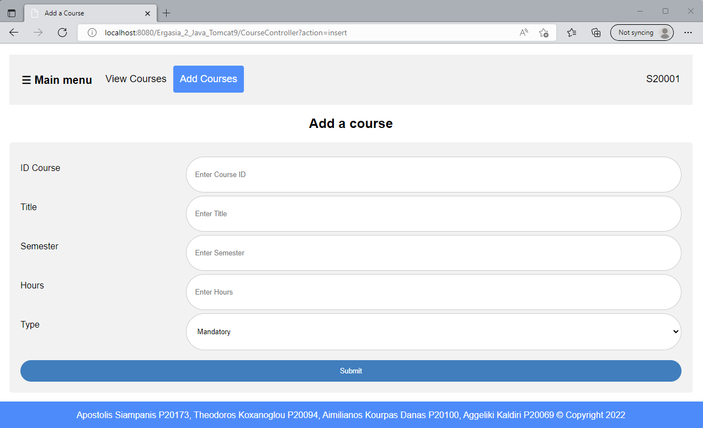
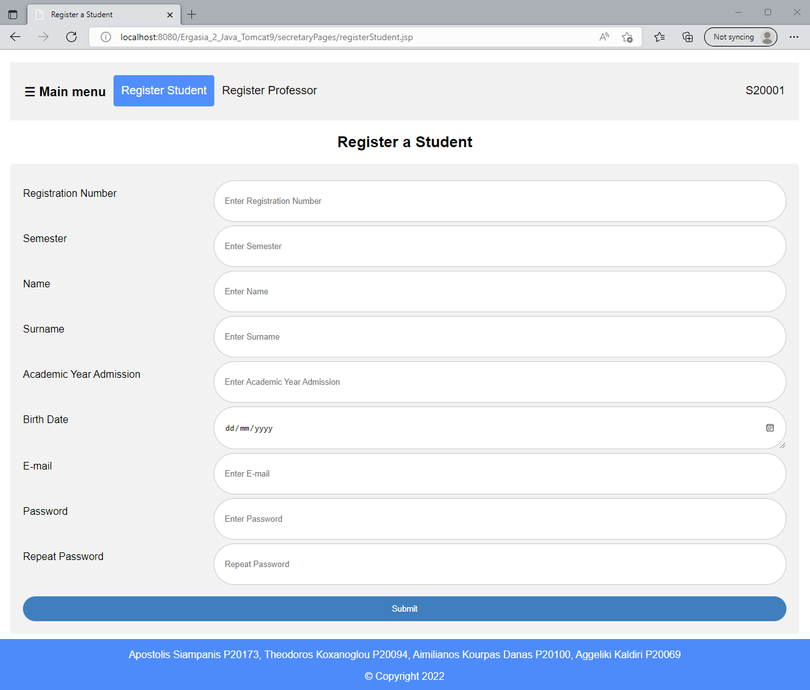
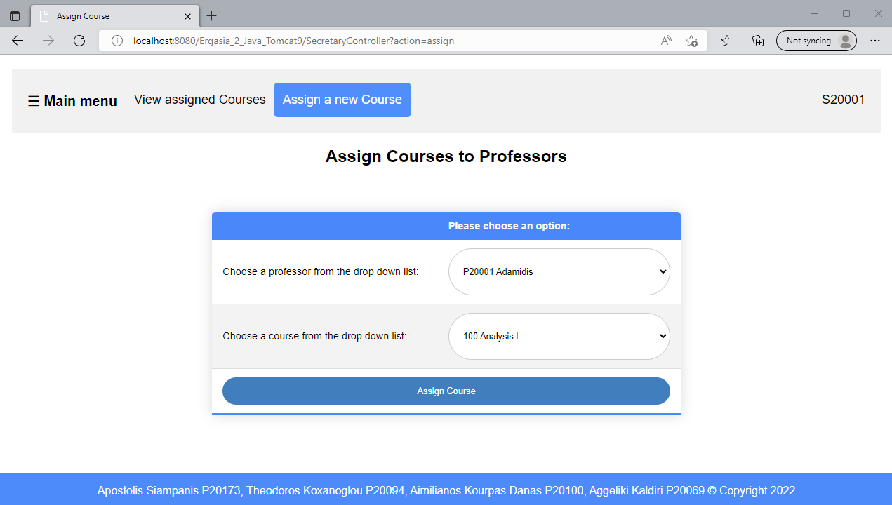
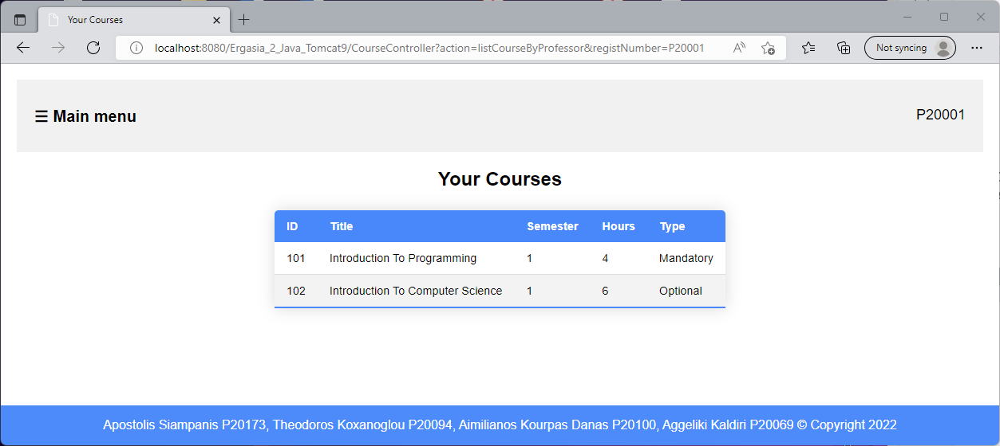
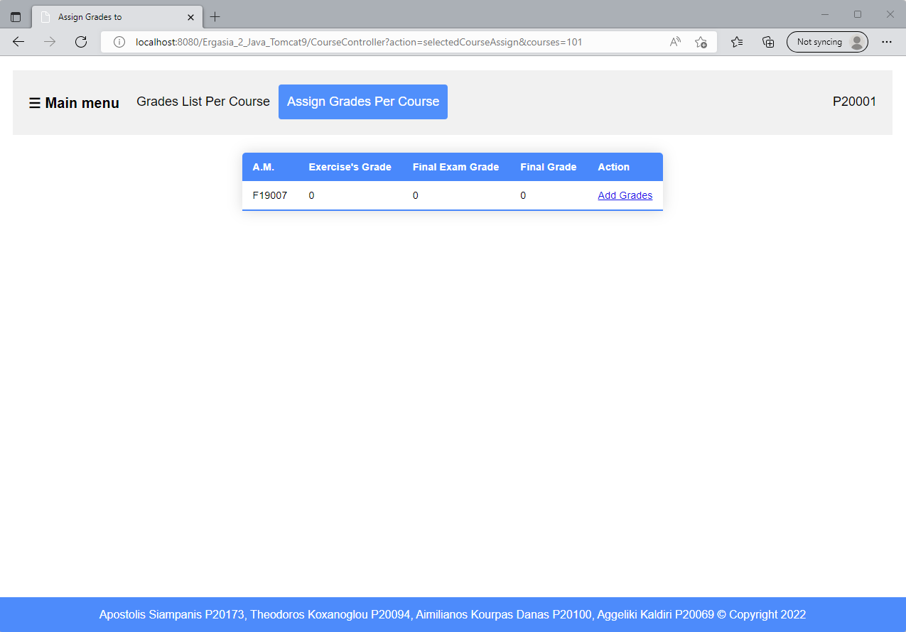
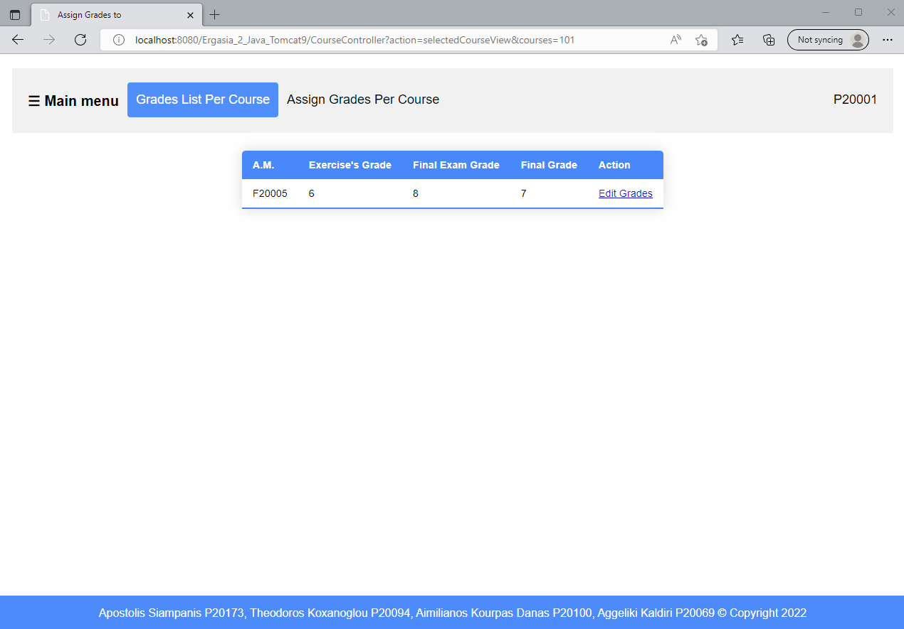
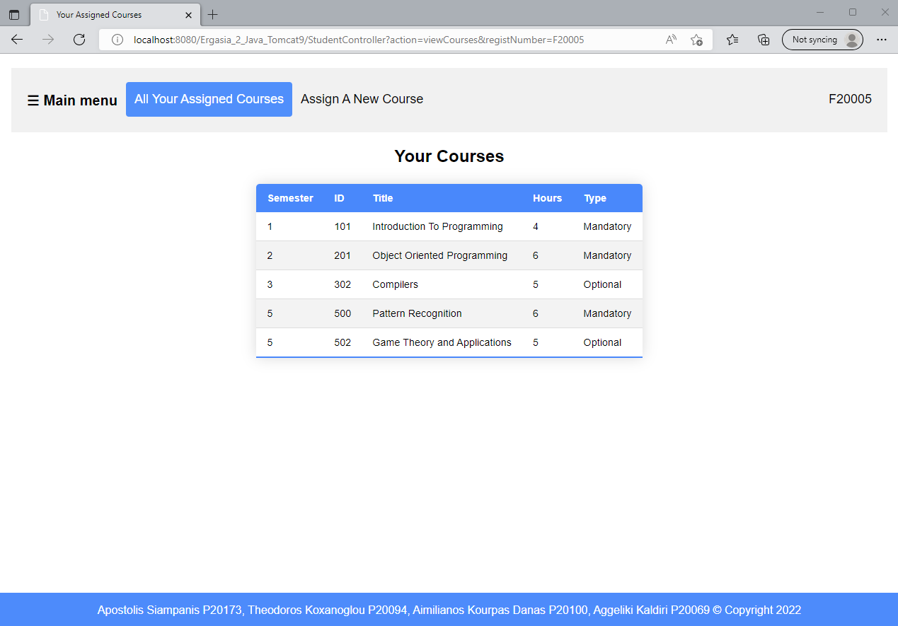
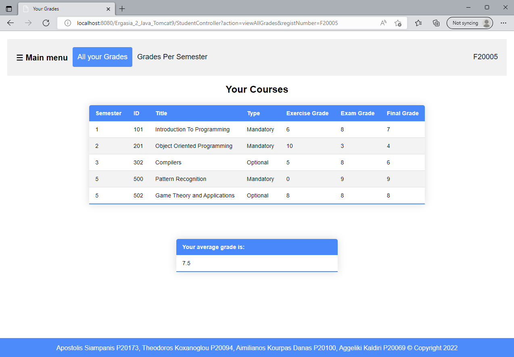
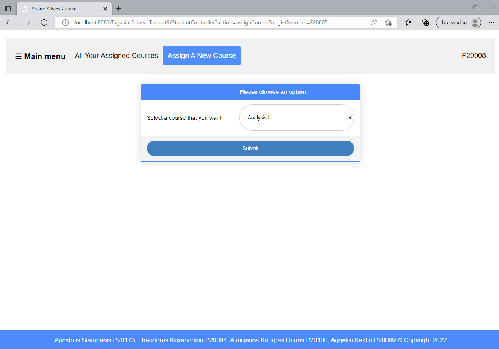

# Internet and Web Programming (2022) - University Grade Portal

## Project Overview

This project is a team assignment for the "Internet and Web Programming" course, offered in the 4th semester of the 2022 academic year at the University of Piraeus, Department of Informatics. The final project involves the development and completion of a 3-tier web application for grade management. The application integrates server-side technologies (servlets and JSP) with database management to create a functional system for different types of users, including students, professors, and secretaries.

## Course Information

- **Institution:** University of Piraeus
- **Department:** Department of Informatics
- **Course:** Internet and Web Programming (2022)
- **Semester:** 4th

## Technologies Used

- Java
- CSS
- Javascript

## Project Structure

### Packages

The project is organized into several packages, each responsible for a different aspect of the application:

1. **com.controller:** Contains servlets that handle communication between the browser and the server.
2. **com.dbUtil:** Contains classes for database connectivity and user authentication.
3. **com.sqlFunctions:** Includes classes with methods that execute SQL queries related to professors, secretaries, students, and courses.
4. **com.university:** Contains classes representing entities such as Student, Professor, Course, etc.
 
### JSP Pages

JSP pages are grouped based on the user roles:

- **secretaryPages:** For Secretary functions (e.g., `addCourse.jsp`, `assignCToP.jsp`).
- **professorPages:** For Professor functions (e.g., `grades.jsp`, `courses.jsp`).
- **studentPages:** For Student functions (e.g., `profile.jsp`, `viewYourGrades.jsp`).
- **adminPages:** For Administrator functions (e.g., `registerSecretary.jsp`).
- **Common Pages:** Pages like `index.jsp`, `login.jsp` are shared among all users.

## Usage Examples

The 3-tier application developed for managing student grades can be used by three different user roles: Secretary, Professor, and Student. Each role has distinct functionalities tailored to their specific needs, allowing seamless interaction with the application.

### 1. Secretary Role
A user with the Secretary role can manage courses, professors, and students. Below are examples of how a Secretary can use the application:

- **Adding a New Course**: The Secretary logs into the system and navigates to the "Add New Course" page under the course management section. Here, they can enter the course title, semester, and assign a professor to the course. After submitting the form, the course is added to the database.

  

- **Registering a New Student**: The Secretary can add new students by going to the "Register Student" page. They fill out the student’s details such as name, department, and enrollment year. After submission, the student is registered in the system, allowing them to log in and access their course information.

  

- **Assigning a Course to a Professor**: The Secretary can assign courses to professors using the "Assign Course to Professor" page. By selecting a course from the list and choosing a professor, the assignment is saved in the database. The professor is then responsible for grading students in that course.

  

### 2. Professor Role
A user with the Professor role can view and manage the grades of students enrolled in their courses. Here are some examples:

- **Viewing Assigned Courses**: After logging in, the Professor can view all the courses assigned to them by navigating to the "View My Courses" page. This page lists each course along with relevant details such as the course title and the semester it is taught.

  

- **Entering Student Grades**: The Professor can enter grades by selecting a course and navigating to the "Assign Grades" page. They can choose a student and enter their grades for the respective course. The grades are then saved to the database and are accessible to the students.

  

- **Editing Student Grades**: If a grade needs to be updated, the Professor can go to the "Edit Grades" page, select the student and course, and modify the grades as necessary. The updated grades are reflected in the system immediately.

  

### 3. Student Role
A user with the Student role can view their course enrollment and grades. Below are examples of how a Student can interact with the application:

- **Viewing Enrolled Courses**: After logging in, the Student can see a list of all courses they are enrolled in by visiting the "My Courses" page. The courses are listed in ascending order by semester, showing the student their academic progress.

  

- **Viewing Grades**: The Student can view their grades for each course by navigating to the "View Grades" page. This page displays the grades for each course, the semester average, and the overall GPA.

  

- **Adding a New Course**: A Student can add a course to their enrollment by visiting the "Add Course" page. They can select a course from the available options, which is then added to their list of enrolled courses.

  

These examples illustrate how each user role interacts with the system, showcasing the flexibility and functionality of the application in managing educational data effectively.

## Setup Instructions

1. Download and install **Eclipse IDE for Enterprise and Web Developers**.
2. Set up **Apache Tomcat 9** as the server.
3. Import the project into Eclipse.
4. Create a MySQL database using the provided `.sql` or `.mwb` file.
5. Update the database connection settings in `DBConnection.java`.

## Contributors

<table>
  <tr>
    <td align="center"><a href="https://github.com/thkox"> <b>Theodoros Koxanoglou</b></a> </td>
    <td align="center"><a href="https://github.com/ApostolisSiampanis"> <b>Apostolis Siampanis</b></a> </td>
    <td align="center"><a href="https://github.com/AimiliosKourpas"> <b>Aimilianos Kourpas</b></a> </td>
   <td align="center"><a href="https://www.linkedin.com/in/aggeliki-kaldiri-a5679828b/"> <b>Aggeliki Kaldiri</b></a> </td>
  </tr>
</table>

## License

This project is licensed under the MIT License - see the [LICENSE](./LICENSE) file for details.
